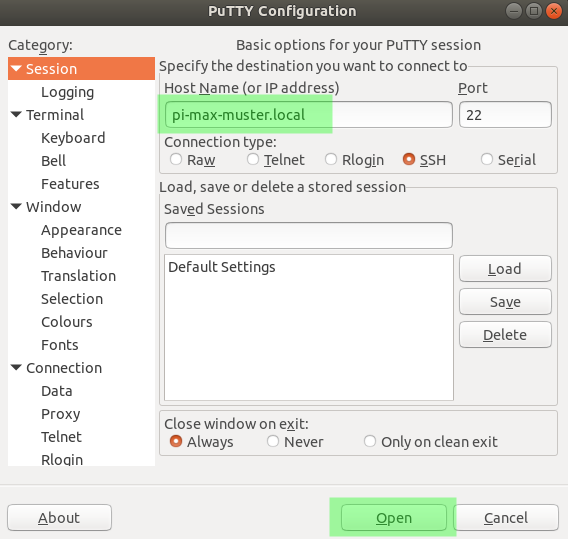

# How to use
1. Download latest release of *HTLRbian* and unzip it locally
2. Use [Etcher](https://www.balena.io/etcher/) to write the image to your SD card
3. Re-insert the SD card on your PC and open file `htl.config` on drive `boot`
4. Enter your HTL Rankweil username and password and save the file
5. Unmount the SD card and boot your Raspberry Pi with the SD card
6. The Raspberry Pi will be accessible on the HTL network via pi-*max-muster*.local (in this case the username was `max.muster`)
7. Use SSH client [Putty](https://the.earth.li/~sgtatham/putty/latest/w32/putty.exe) to connect to your Raspberry Pi.
8. Username for login is `pi`, password is your HTL Rankweil password

